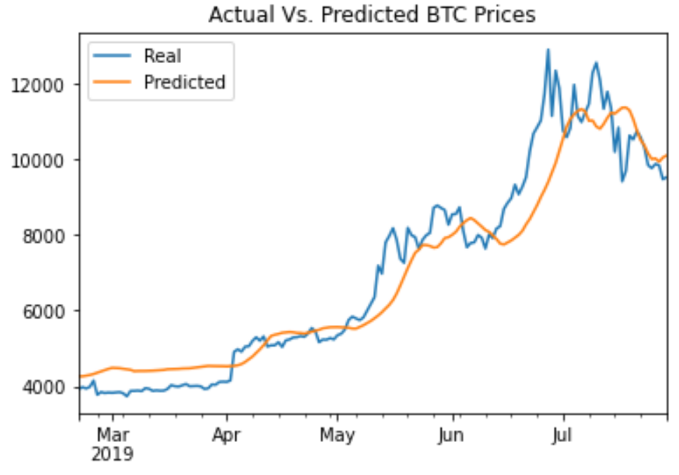

### Below are the results of comparing deep learning recurrent neural networks LSTM models for Fear and Greed sentiment affect on prices vs window Closing price model

**We see that the Fear and Greed Sentiment on its own is lesser of predicator of price of BTC in comparison to window of closing prices model. We kept the architecture same for both models and ran the models for different batch sizes.** 

**We also saw that batch size 90 did better than other lower batch sizes.**

|                           | Fear and Greed RNN LSTM model                                | Closing price RNN LSTM model                                 |
| ------------------------- | ------------------------------------------------------------ | ------------------------------------------------------------ |
| Batch size=90, epochs=10  | Mean squared error = 0.06463290005922318                     | Mean squared error = 0.0073529453948140144                   |
|                           |  |  |
| Batch size=4, epochs=10   | Mean squared error = 0.08329661190509796                     | Mean squared error = 0.03365952521562576                     |
|                           |  |  |
| Batch size =2 , epochs=10 | Mean squared error = 0.10728645324707031                     | Mean squared error = 0.014869374223053455                    |
|                           |  |  |
|                           |                                                              |                                                              |
|                           |                                                              |                                                              |
|                           |                                                              |                                                              |

#### Architecture summary for both models:

